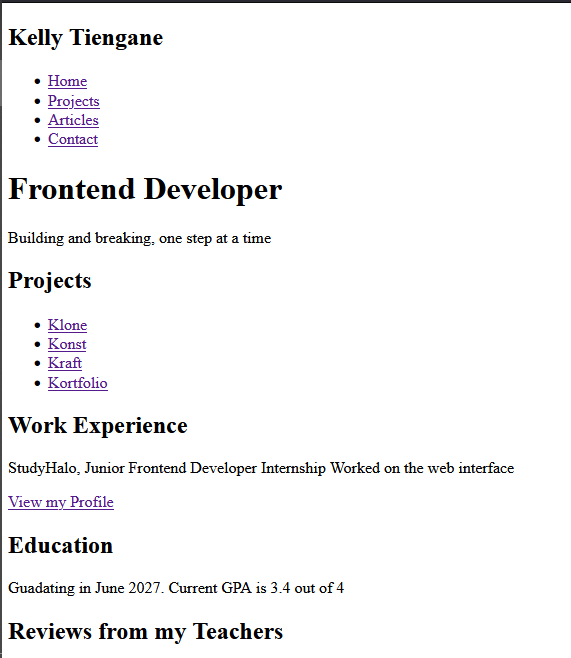

# Basic HTML Website

This project is part of a challenge recommended by Roadmap.sh, designed to help front-end developers gain a solid understanding of how to structure a website using HTML, basic SEO meta tags, HTML tags, forms, etc, and prepare our webpage for future styling.

You can find the challenge <a href="https://roadmap.sh/projects/basic-html-website">here</a> and the live view of my submission <a href="https://klytne-basic-html-website.netlify.app">here</a>

### Requirements

- [x] Semantically correct HTML structure.
- [x] Multiple pages with a navigation bar.
- [x] SEO meta tags in the head of each page.
- [x] The contact page should have a form with fields like name, email, message etc.

### Screenshots 

